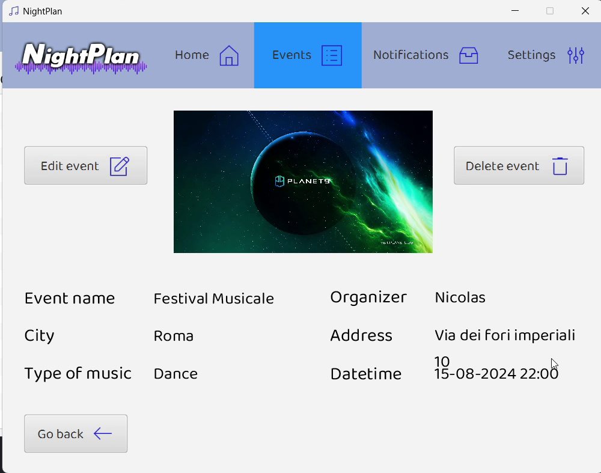
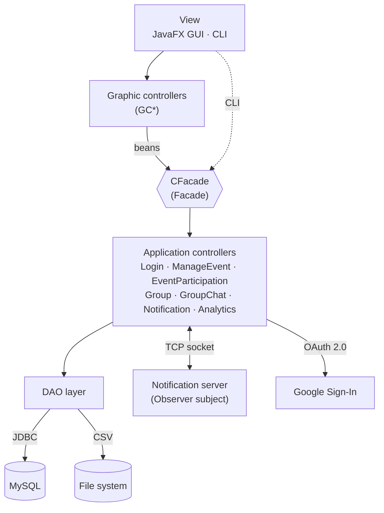
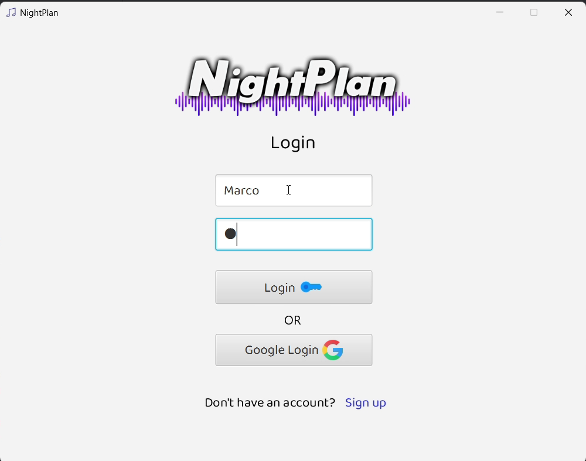
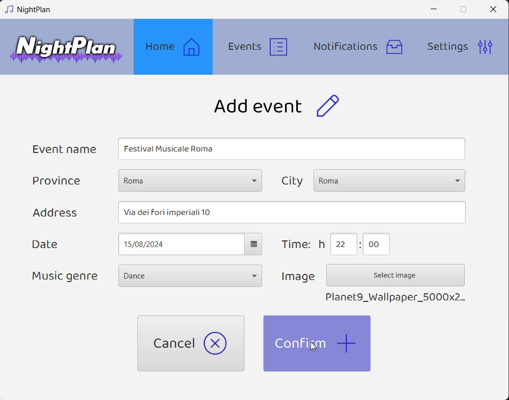
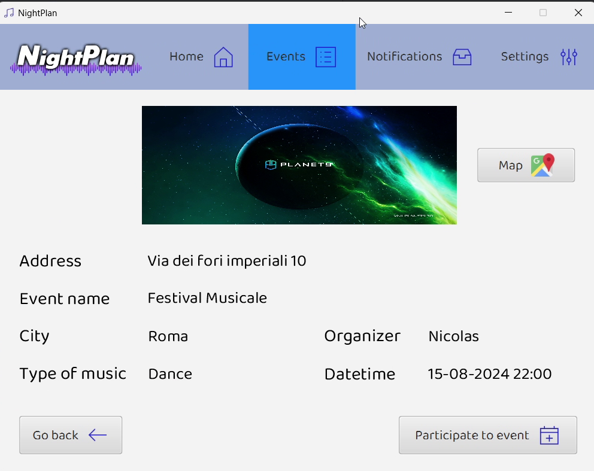
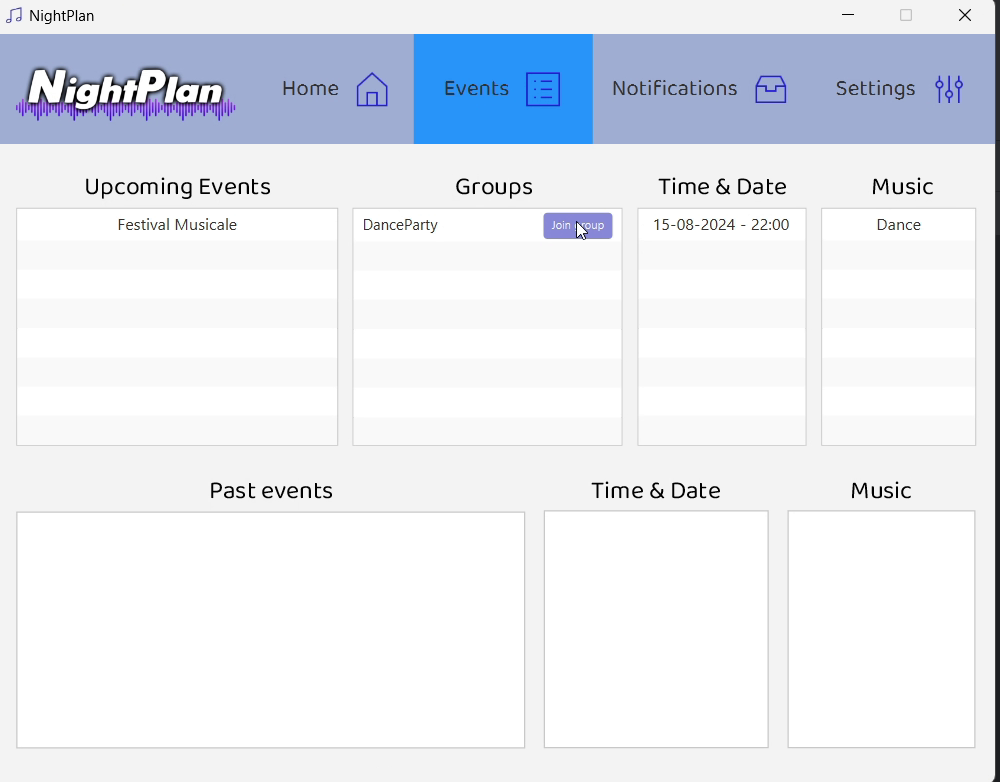
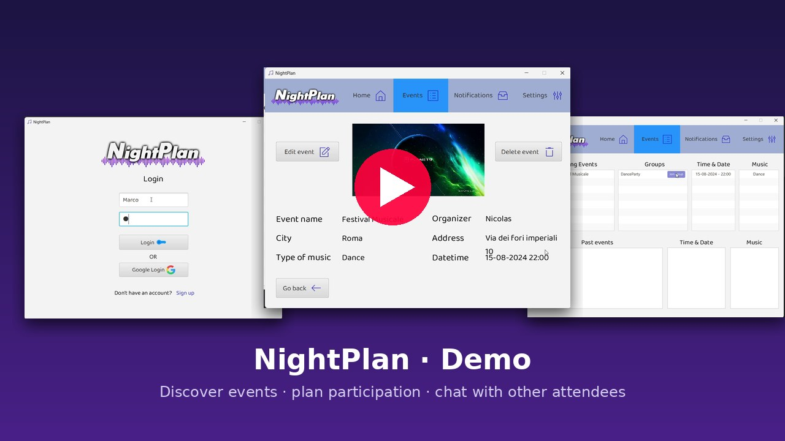

# NightPlan: Musical Events & Shows Manager


[](https://github.com/DeveloperMatt02/NightPlan/actions/workflows/ci.yml)


> Developed for the **Software Engineering and Web Design** course (*Ingegneria del Software e Progettazione Web*, A.Y. 2023/24),
> B.Sc. in Computer Engineering at the **University of Rome Tor Vergata**.

**NightPlan** is a desktop application that helps people **discover nightlife events in their city, plan their participation and meet other attendees**.
Organizers get a single channel to publish events, reach users in real time and measure how their events perform, without having to promote them on social media, websites or TV.

<p align="center">
  
</p>

## 🚀 Overview

NightPlan has two kinds of accounts. **Users** browse the events in their city, book their participation, join the event's group and chat with the other participants.
**Organizers** create and manage events, get notified when someone joins, and look at per-event analytics.

The project was designed with a full software-engineering process (user stories, functional requirements, use cases, storyboards and UML diagrams) and then implemented in Java following a layered **MVC** architecture with GoF design patterns.

### Key Features

1. **Event discovery by city.** Users see every upcoming event in their city with poster, address, music genre, date and time.
2. **Participation planning.** Users book or cancel a participation and keep an archive of upcoming and past events.
3. **Event groups & real-time chat.** Participants create or join the group of an event and chat live with each other.
4. **Real-time notifications.** A socket server pushes notifications (e.g. *new event in your city*, *new participant*) to online clients through the Observer pattern.
5. **Event management for organizers.** Organizers create, edit and delete events and upload a poster image. Input is validated through domain exceptions.
6. **Analytics.** Per-event clicks, planned and actual participants, exportable as a `.txt` report.
7. **Authentication.** Classic registration (18+) or **Sign in with Google** (OAuth 2.0).
8. **Two UIs, two persistence modes.** A JavaFX GUI and a complete command-line interface. Notifications can be stored in MySQL (JDBC) or in CSV files.

## 🧠 Architecture



| Pattern | Used for |
|---------|----------|
| **Facade** | `CFacade` decouples both UIs from the application controllers |
| **Observer** | The server notifies *users in a city*, *event organizers* and *group members* |
| **Factory** | Creation of notifications, chat messages and observers |
| **Singleton** | Shared JDBC session (`SingletonDBSession`) |
| **DAO** | Persistence abstraction with JDBC and CSV implementations |

More details in [docs/ARCHITECTURE.md](docs/ARCHITECTURE.md).

## 🖼️ Screenshots

| Login | Add event (organizer) |
|:---:|:---:|
|  |  |
| **Event page (user)** | **Your events (user)** |
|  |  |

## 🎥 Demo

[](https://youtu.be/LjPVBJZy7sE) 

## 🛠️ Tech Stack

* **Language:** Java 21 (JPMS modules)
* **UI:** [JavaFX 21](https://openjfx.io/) with FXML + CSS, plus a text-based CLI
* **Persistence:** [MySQL 8](https://www.mysql.com/) via JDBC, [OpenCSV](https://opencsv.sourceforge.net/) for file-system mode
* **Networking:** Java sockets with object serialization (whitelisted deserialization)
* **Authentication:** [Google OAuth Client](https://github.com/googleapis/google-oauth-java-client)
* **Build & quality:** Maven, JUnit 5, GitHub Actions, SonarCloud (during development)

## 📖 Documentation

* [Architecture Overview](docs/ARCHITECTURE.md)
* [Requirements](docs/REQUIREMENTS.md): user stories, functional requirements, use cases
* [Technical Design](docs/TECHNICAL_DESIGN.md): UML diagrams, exceptions, testing, design discrepancies
* [Original Technical Documentation (PDF)](docs/NightPlan-Technical-Documentation.pdf)
* [Course deliverables](docs/deliverables): storyboards and UML diagrams (PDF)

## 🚦 Getting Started

### Prerequisites

* JDK 21
* Maven 3.9+
* MySQL 8 (not needed if you only want to build the project)
* *(optional)* A Google Cloud OAuth client of type **Desktop app**, for *Sign in with Google*

### Installation

1. **Clone the repository**
   ```bash
   git clone https://github.com/DeveloperMatt02/NightPlan.git
   cd NightPlan
   ```

2. **Create the database** (schema + demo data)
   ```bash
   mysql -u root -p < sql/01_create_database.sql
   mysql -u root -p nightplan < sql/02_schema_and_seed_data.sql
   ```

3. **Configure the application**
   ```bash
   cp config/config.properties.example config/config.properties
   # then edit db.username / db.password
   ```
   Every setting can also be provided as an environment variable (e.g. `NIGHTPLAN_DB_PASSWORD`).
   For Google Sign-In, copy `config/client_secrets.json.example` to `config/client_secrets.json` and fill in your OAuth client.

4. **Build**
   ```bash
   mvn verify
   ```

### Running the App

NightPlan is a client–server application: start the **server** first, then one or more **clients**.

```bash
# 1. Notification & chat server (port 2521 by default)
mvn compile exec:java -Dexec.mainClass=it.uniroma2.nightplan.server.Server

# 2a. JavaFX client (JDBC persistence by default)
mvn javafx:run
#     ...or with file-system persistence for notifications
mvn javafx:run -Djavafx.args="FileSystem"

# 2b. Command-line client
mvn compile exec:java -Dexec.mainClass=it.uniroma2.nightplan.view.CLI
```

**Demo accounts** (created by the seed script):

| Username | Password | Role |
|----------|----------|------|
| `Matteo` | `Matteo` | User (Rome) |
| `Nicolas` | `Nicolas` | Organizer |

### Running the tests

The JUnit tests are **integration tests** that run against the seeded MySQL database:

```bash
mvn verify -Pintegration-tests
```

## 📂 Project Structure

```text
NightPlan/
├── pom.xml
├── config/                           # *.example configuration templates (real files are git-ignored)
├── sql/                              # database creation, schema and seed data
├── src/
│   ├── main/java/it/uniroma2/nightplan/
│   │   ├── beans/                    # validated DTOs between view and logic
│   │   ├── controllers/              # application controllers + CFacade
│   │   │   └── factory/              # Factory pattern
│   │   ├── dao/                      # JDBC & CSV data access
│   │   ├── exceptions/               # domain exceptions
│   │   ├── graphiccontrollers/       # JavaFX controllers
│   │   ├── model/                    # domain model, notifications, observers
│   │   ├── server/                   # socket server (Observer subject)
│   │   ├── utils/                    # config, DB session, logged user, enums
│   │   └── view/                     # JavaFX entry point, CLI
│   ├── main/resources/               # FXML views, CSS, icons, images
│   └── test/java/                    # JUnit 5 integration tests
├── docs/
│   ├── ARCHITECTURE.md
│   ├── REQUIREMENTS.md
│   ├── TECHNICAL_DESIGN.md
│   ├── deliverables/                 # UML diagrams & storyboards (PDF), per use case
│   └── images/                       # screenshots and rendered diagrams
└── .github/workflows/ci.yml          # build on every push
```

## ⚠️ Known Limitations

This is an academic project, so a few shortcuts were taken on purpose:

* User passwords are stored in plain text. A production version would hash them (e.g. bcrypt/Argon2).
* Google Sign-In uses the out-of-band (`urn:ietf:wg:oauth:2.0:oob`) redirect, which Google has since deprecated. New OAuth clients need a loopback redirect.
* Address verification through the Google Maps API was designed but not implemented (see [design discrepancies](docs/TECHNICAL_DESIGN.md#8-design-vs-implementation-discrepancies)).
* The seed script loads event posters with `LOAD_FILE` from a Windows MySQL uploads path. On other systems the demo events have no poster until you upload one from the app.

## 👥 Team

| Member | Main responsibilities |
|--------|-----------------------|
| **Matteo Trossi** ([@DeveloperMatt02](https://github.com/DeveloperMatt02)) | *Create Event* use case, event management (add/edit/delete), group chat, analytics, Factory pattern |
| **Nicolas Oberi** ([@snyppololo](https://github.com/snyppololo)) | *Plan Event Participation* use case, event discovery, notifications, Observer pattern |

Supervised by Prof. Davide Falessi and Prof. Guglielmo De Angelis.

## 📄 License

This project is licensed under the MIT License. See the [LICENSE](LICENSE) file for details.
