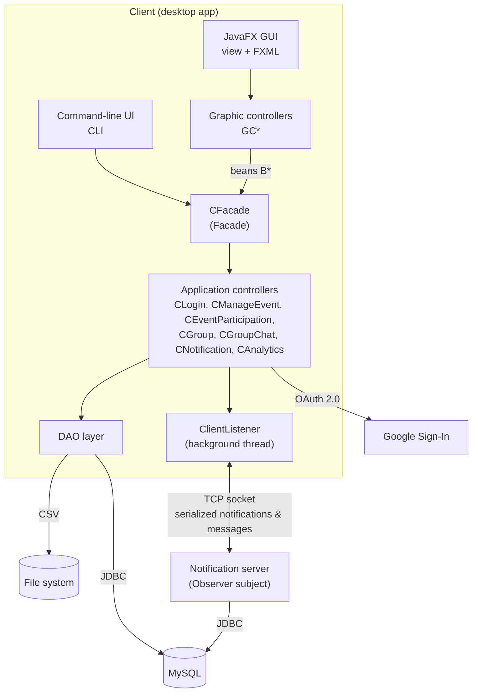

# Architecture

NightPlan is a **Java 21 / JavaFX desktop application** built on a layered **MVC architecture**
with a separation between *graphic controllers* and *application controllers* (the approach used in
the *Ingegneria del Software e Progettazione Web* course). A lightweight **socket server** delivers
real-time notifications and chat messages to connected clients.

## High-level view



## Layers

| Layer | Package | Responsibility |
|-------|---------|----------------|
| **View** | `it.uniroma2.nightplan.view` | `EssentialGUI` (JavaFX entry point and scene navigation), `CLI` (full text-based alternative UI), popups. Both UIs implement `NotificationView` and `ChatView`, so controllers can push updates without knowing which UI is running. |
| **Graphic controllers** | `...graphiccontrollers` | One `GC*` class per FXML screen. They read the UI fields, wrap them in beans and call the facade. |
| **Beans** | `...beans` | `B*` data-transfer objects between the view and the application layer. Setters **validate input** and throw domain exceptions (e.g. `TextTooLongException`, `InvalidValueException`, `MinimumAgeException`). |
| **Application controllers** | `...controllers` | Business logic for each use case, exposed through a single `CFacade`. |
| **Model** | `...model` | Domain entities (`MEvent`, `MUser`, `MGroup`, `MGroupMessage`), notification/message hierarchy and observers. |
| **Persistence** | `...dao` | One DAO per aggregate (`EventDAO`, `UserDAO`, `GroupDAO`, `ChatDAO`, `LocationDAO`, `UserEventDAO`, `NotificationDAO`). |
| **Server** | `...server` | Multi-client TCP server that keeps the subscriptions and dispatches notifications and chat messages. |
| **Utilities** | `...utils` | Session state (`LoggedUser`), configuration (`AppConfig`), DB connection (`SingletonDBSession`), persistence selection, enums. |

## Design patterns

| Pattern | Where | Why |
|---------|-------|-----|
| **Facade** | `CFacade` | Single entry point between graphic controllers (and CLI) and the application controllers, which keeps the UI decoupled from the business logic. |
| **Observer** | `server.Subject` / `Server`, `ObserverClass` → `NotiObserverClass`, `MessageObserverClass` | Clients subscribe to three kinds of subjects: *users in a city*, *event organizer* and *users in a group*. When an event is created, a user joins an event or a message is sent, the server notifies only the relevant observers. |
| **Factory** | `controllers.factory.NotificationFactory`, `MessageFactory`, `ObserverFactory` | Centralises the creation of `ServerNotification` vs `LocalNotification`, chat messages and observers depending on the context (`SituationType`). |
| **Singleton** | `SingletonDBSession` | A single shared access point to the JDBC connection for every DAO. |
| **DAO + Strategy-like switch** | `NotificationDAO` → `NotificationDAOJDBC` / `NotificationDAOCSV` | The persistence technology for notifications is chosen at startup (`JDBC` or `FileSystem`). |

## Client–server communication

1. On login, the client opens a TCP socket to the server (`server.host:server.port`, default `localhost:2521`)
   and starts a daemon `ClientListener` thread.
2. The client sends a `ServerNotification` (e.g. `LOGGED_IN`, `EVENT_ADDED`, `USER_EVENT_PARTICIPATION`,
   `GROUP_JOIN`, `CHANGE_CITY`…) through an `ObjectOutputStream`.
3. The server updates its subscription maps (city → users, organizer → events, group → members) and
   forwards the notification or `MGroupMessage` to the interested observers.
4. The `ClientListener` receives the object and updates the active view (a notification badge or the chat window).

**Secure deserialization:** incoming objects are read through `SecureObjectInputStream`, which only
accepts a whitelist of known classes, to prevent Java deserialization attacks.

## Persistence

- **MySQL (default):** schema and seed data in [`sql/`](../sql). All DAOs use JDBC `PreparedStatement`s.
- **File system:** notifications can be stored in `csvData/DBNotifications.csv` (OpenCSV), so notifications
  still work in a lightweight setup.

Select the persistence mode with the first program argument (`JDBC` | `FileSystem`) for the GUI,
or interactively when starting the CLI.

## Configuration

Runtime settings are resolved by `AppConfig` in this order: **environment variables → `config/config.properties`
→ defaults**. See [`config/config.properties.example`](../config/config.properties.example).
Credentials are never committed to the repository.

## Source layout

```text
src/main/java/it/uniroma2/nightplan/
├── beans/               # B*  – validated DTOs
├── controllers/         # C*  – application logic, CFacade, ClientListener, GoogleLogin
│   └── factory/         # Notification / Message / Observer factories
├── dao/                 # JDBC and CSV data access objects
├── exceptions/          # 10 domain-specific exceptions
├── graphiccontrollers/  # GC* – JavaFX controllers (one per FXML screen)
├── model/               # M*  – domain model, notifications, observers
├── server/              # socket server (Observer subject)
├── utils/               # AppConfig, SingletonDBSession, LoggedUser, enums
└── view/                # EssentialGUI (JavaFX), CLI, popups
src/main/resources/
├── it/uniroma2/nightplan/view/   # 20 FXML screens + application.css
├── icons/                        # UI icons
└── images/                       # logo and sample event posters
```
