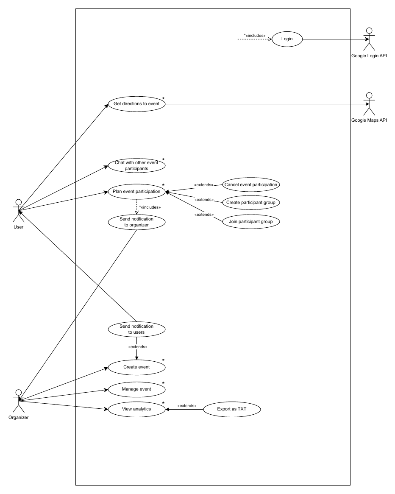

  

# Requirements

This document summarises the **Software Requirements Specification** of NightPlan.
The full original version (Italian university deliverable, written in English) is available in
[`NightPlan-Technical-Documentation.pdf`](NightPlan-Technical-Documentation.pdf).

## 1. Product overview

NightPlan is a standalone desktop application that helps people **discover local events and meet new friends**.
It gives users a single place to browse every event organised in their city, and gives event organisers
a direct channel to reach a wide audience without relying on social media, websites or TV.

### Actors

| Actor | Description |
|-------|-------------|
| **User** | Browses events in their city, plans participation, joins event groups and chats with other participants. |
| **Organizer** | Creates, edits and deletes events, receives participation notifications and looks at event analytics. |
| **Google Login API** | External system used for the optional *Sign in with Google* flow (OAuth 2.0). |
| **Google Maps API** | External system used to open directions to an event. |

### Related systems

| System | Limitation | How NightPlan differs |
|--------|------------|------------------------|
| **Meetup** | Participation is restricted to the events of the groups you joined. | Every event organised in the user's city is visible. |
| **Eventbrite** | No groups for social interaction among participants. | Participants can create/join an event group and chat together. |

## 2. User stories

| # | Story | Owner |
|---|-------|-------|
| US-1 | As a **user**, I want to see all the events in my city, so that I don't have to search multiple sources (social pages, websites). | Nicolas Oberi |
| US-2 | As a **user**, I want to book my attendance for an event, so that I am sure I can attend it. | Nicolas Oberi |
| US-3 | As an **organizer**, I want people to know when I post a new event in their city, so that I can have more customers. | Nicolas Oberi |
| US-4 | As a **user**, I want to chat with other users participating in the same event, to make new friends. | Matteo Trossi |
| US-5 | As an **organizer**, I want to see analytics about my past events (clicks, planned and actual participants), so that I can improve future events. | Matteo Trossi |
| US-6 | As an **organizer**, I want to edit an event, so that I can keep users informed about changes. | Matteo Trossi |

## 3. Functional requirements

| # | Requirement | Owner |
|---|-------------|-------|
| FR-1 | The system shall display the available events in the user's city. | Nicolas Oberi |
| FR-2 | The system shall show photos and information provided by the organizer on the event page. | Nicolas Oberi |
| FR-3 | The system shall provide a past-events archive for the organizer. | Nicolas Oberi |
| FR-4 | The system shall provide a group chat among users participating in the same event. | Matteo Trossi |
| FR-5 | The system shall provide an interface to add, update or delete events created by the organizer. | Matteo Trossi |
| FR-6 | The system shall provide an analytics page for the event organizer. | Matteo Trossi |

## 4. Use cases

Use cases marked with `*` in the diagram were implemented in the final application.
The team split the detailed analysis by use case:

- **Create Event**: Matteo Trossi
- **Plan Event Participation**: Nicolas Oberi

### UC — Create Event *(Matteo Trossi)*

**Primary actor:** Organizer

1. The system verifies that the user is logged in as an organizer.
2. The organizer selects *Add a new event*.
3. The system prepares a blank creation form.
4. The organizer fills in all the fields (name, province, city, address, date, time, music genre, poster image).
5. ~~The system uses the Google Maps API to verify the address.~~ *(not implemented, see discrepancies)*
6. The organizer confirms the creation of the event.
7. The system stores the new event in the database.
8. The system shows a confirmation popup.
9. The system notifies every user in the event's city that a new event is available.

**Extensions**

| Step | Condition | Behaviour |
|------|-----------|-----------|
| 4a | Input text is too long | Ask the organizer for a shorter value (`TextTooLongException`). |
| 4b | Invalid time format | Ask for a valid time (`InvalidValueException`). |
| 4c | Date is empty or in the past | Ask for a valid date (`InvalidValueException`). |
| 6a | An event with the same name already exists | Ask the organizer to change the name (`EventAlreadyAdded`). |
| 7a | Database failure | Notify the organizer that the creation failed and end the use case. |

### UC — Plan Event Participation *(Nicolas Oberi)*

**Primary actor:** User

1. The system retrieves all the available events in the user's city.
2. The user selects an event.
3. The system shows the event information.
4. The user confirms the participation.
5. The system notifies the user that the participation is confirmed.
6. The system notifies the event organizer of the new participation.

**Extensions**

| Step | Condition | Behaviour |
|------|-----------|-----------|
| 1a | The event catalogue does not respond | Notify the user and end the use case. |
| 1b | No events available in the user's city | Notify the user and end the use case. |
| 4a | The user does not confirm | Go back to the home page. |

## 5. Non-functional requirements

| Category | Requirement |
|----------|-------------|
| Platform | Windows 10+, macOS 10.14+, Linux (kernel 3.10+) |
| Runtime | Java 21 (JavaFX 21) |
| Hardware | Intel Core i3 or equivalent, 2 GB RAM, 1280×800 display |
| Persistence | MySQL 8 (JDBC); notifications can alternatively be stored on the file system (CSV) |
| Code quality | Continuous static analysis with SonarCloud during development |

## 6. Storyboards

The UI was prototyped in Figma before implementation. The storyboards are available as PDFs:

- [Create Event storyboards](deliverables/create-event/storyboards.pdf) (Matteo Trossi)
- [Plan Event Participation storyboards](deliverables/plan-event-participation/storyboards.pdf) (Nicolas Oberi)
