<p align="center">
  <a href="../README.md">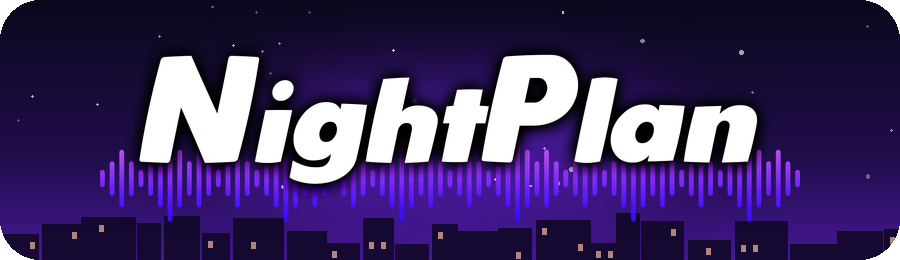</a>
</p>

# Technical Design

This document collects the design artefacts produced for NightPlan: UML diagrams, exception handling,
testing strategy and the differences between the design and the final implementation.
Each diagram links to its original PDF in [`deliverables/`](deliverables).

The design work was divided by use case:

| Use case | Owner | Design pattern led |
|----------|-------|--------------------|
| **Create Event** | Matteo Trossi | Factory |
| **Plan Event Participation** | Nicolas Oberi | Observer |

---

## 1. Class diagrams

### 1.1 View of Participating Classes (VOPC)

<details>
<summary><b>Create Event</b>: Matteo Trossi</summary>

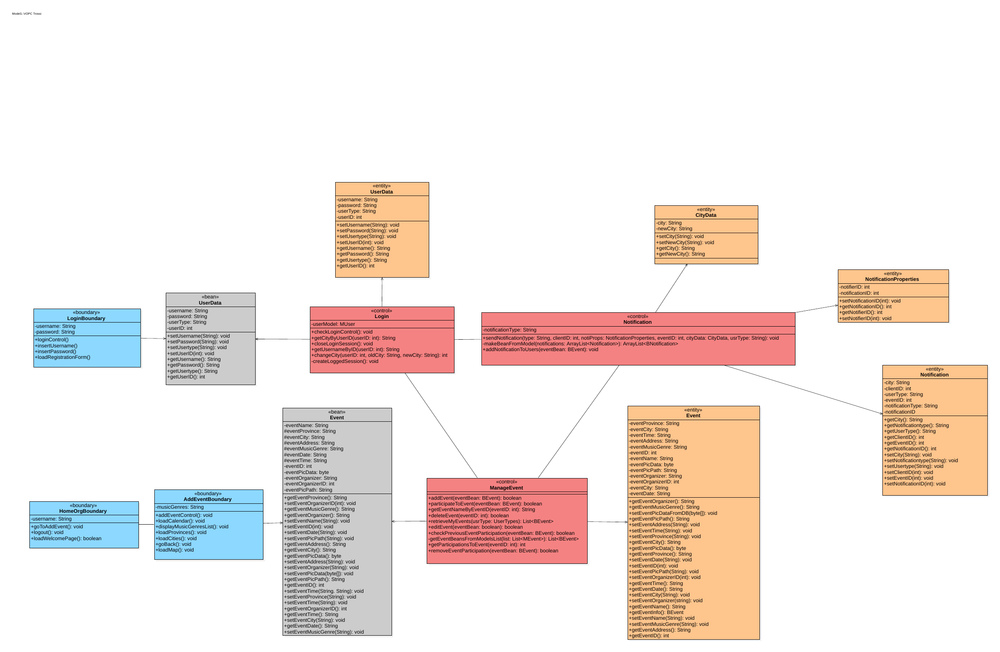

[PDF](deliverables/create-event/class-diagram-vopc.pdf)
</details>

<details>
<summary><b>Plan Event Participation</b>: Nicolas Oberi</summary>

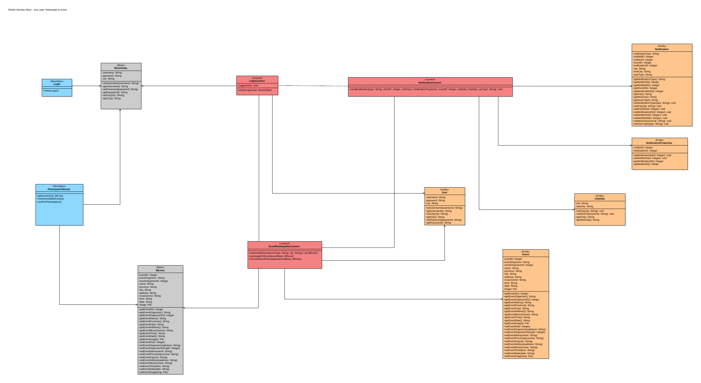

[PDF](deliverables/plan-event-participation/class-diagram-vopc.pdf)
</details>

### 1.2 Design-level class diagrams

<details open>
<summary><b>Create Event</b>: Matteo Trossi</summary>

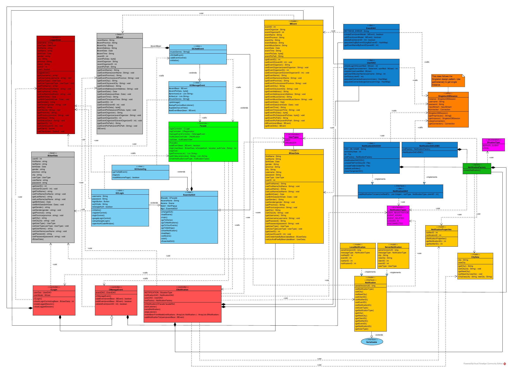

[PDF](deliverables/create-event/class-diagram-design-level.pdf)
</details>

<details>
<summary><b>Plan Event Participation</b>: Nicolas Oberi</summary>

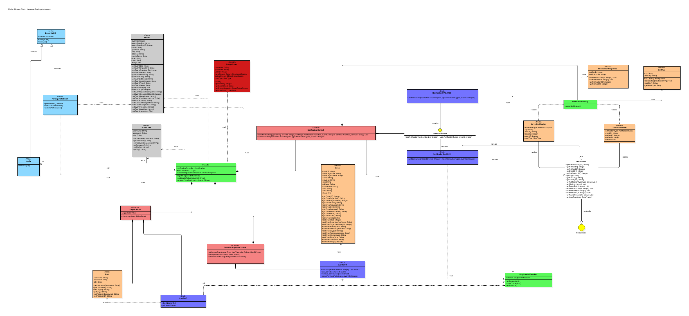

[PDF](deliverables/plan-event-participation/class-diagram-design-level.pdf)
</details>

## 2. Activity diagrams

<details>
<summary><b>Create Event</b>: Matteo Trossi</summary>

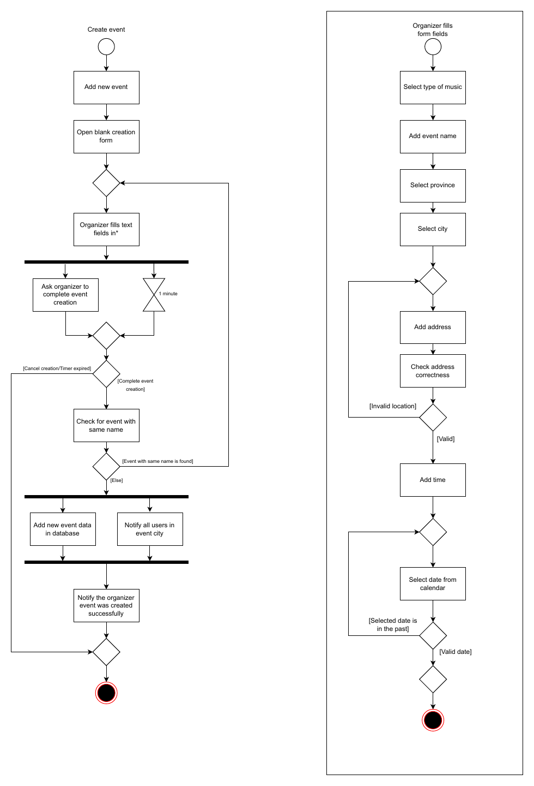
</details>

<details>
<summary><b>Plan Event Participation</b>: Nicolas Oberi</summary>

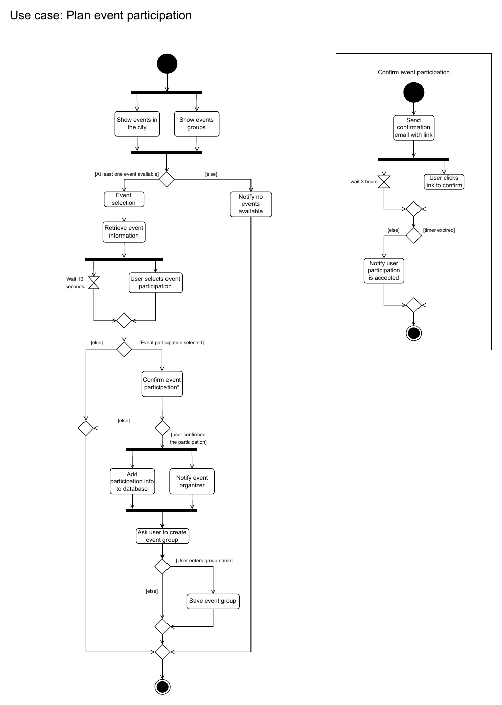
</details>

## 3. Sequence diagrams

<details>
<summary><b>Create Event</b>: Matteo Trossi</summary>

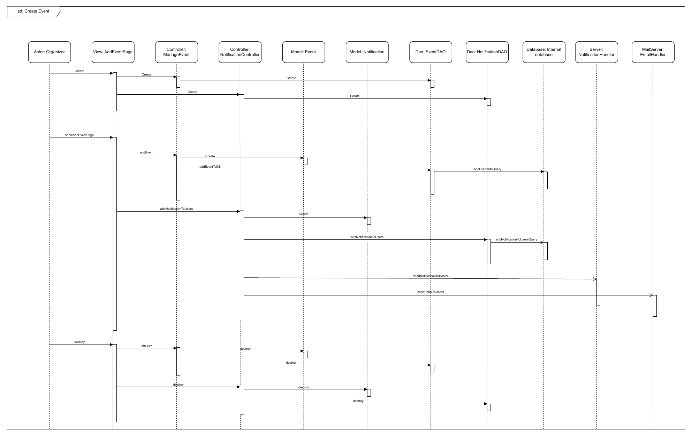
</details>

<details>
<summary><b>Plan Event Participation</b>: Nicolas Oberi</summary>

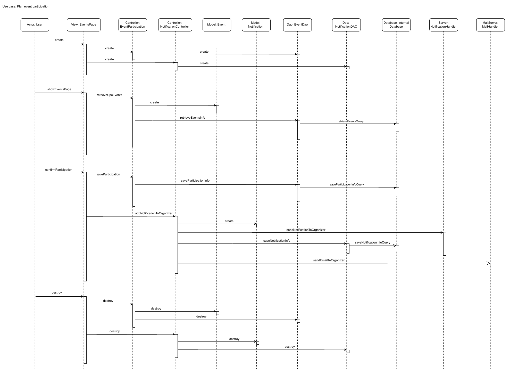
</details>

## 4. State diagrams

<details>
<summary><b>Create Event</b>: Matteo Trossi</summary>

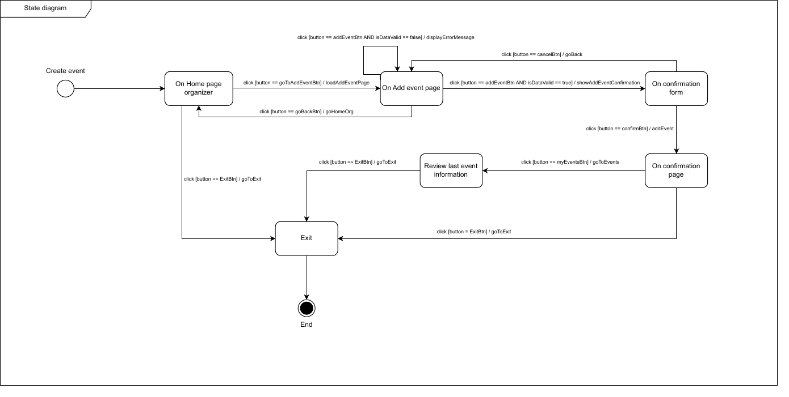
</details>

<details>
<summary><b>Plan Event Participation</b>: Nicolas Oberi</summary>

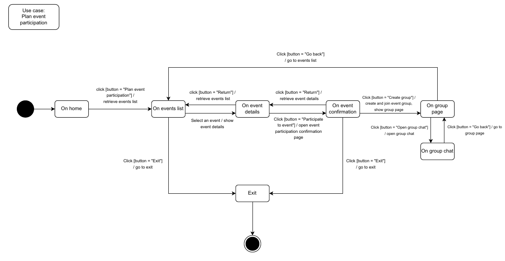
</details>

---

## 5. Exception handling

Custom checked exceptions make error handling specific, readable and easy to debug.
Most of them are thrown by **bean setters** during input validation, so invalid data never
reaches the application controllers.

| Exception | Thrown when | Owner |
|-----------|-------------|-------|
| `EventAlreadyAdded` | An organizer creates an event with the same name as an existing one. | Matteo Trossi |
| `EventAlreadyDeleted` | A user tries to create/join the group of an event that the organizer has just deleted. | Matteo Trossi |
| `InvalidValueException` | A form contains an invalid value (e.g. a wrong date/time format). | Matteo Trossi |
| `MinimumAgeException` | A user registers with an age below 18. | Matteo Trossi |
| `TextTooLongException` | A text field exceeds the maximum allowed length. | Matteo Trossi |
| `DuplicateEventParticipation` | A user tries to join an event twice. | Nicolas Oberi |
| `GroupAlreadyCreated` | Two users race to create the group of the same event. | Nicolas Oberi |
| `InvalidGroupName` | A group is created with an empty name. | Nicolas Oberi |
| `InvalidTokenValue` | An invalid Google authorization code is entered during Google Sign-In. | Nicolas Oberi |
| `UsernameAlreadyTaken` | A new account is registered with an existing username. | Nicolas Oberi |

## 6. Testing

Six JUnit 5 test classes exercise the application controllers through `CFacade`.
They are **integration tests**: they run against the MySQL database populated by
[`sql/02_schema_and_seed_data.sql`](../sql/02_schema_and_seed_data.sql), and they are tagged `integration`.

| Test class | What it verifies | Owner |
|------------|------------------|-------|
| `TestLoginController` | Registration of a new user; change of city for a registered user. | Matteo Trossi |
| `TestGroupController` | Creation of an event group; joining an existing group. | Matteo Trossi |
| `TestEventParticipation` | Participating to an event, removing the participation, detecting a previous participation. | Matteo Trossi |
| `TestManageEvent` | Creation of a new event; editing an existing event. | Nicolas Oberi |
| `TestNotificationController` | Creation of a new notification. | Nicolas Oberi |
| `TestChatController` | Sending a message to a group chat. | Nicolas Oberi |

```bash
# unit build (integration tests skipped)
mvn verify

# integration tests: needs a running MySQL instance initialised with sql/*.sql
mvn verify -Pintegration-tests
```

> The integration tests modify the database. Re-run the SQL scripts to reset it before each run.

## 7. Code quality

During development the repository was continuously analysed with **SonarCloud** (bugs, code smells,
security hotspots, duplication), and the issues it reported were fixed as part of the workflow.
Today the repository is built on every push by the GitHub Actions [CI workflow](../.github/workflows/ci.yml).

## 8. Design vs. implementation discrepancies

Differences between the initial design and the delivered application, documented as required by the course.

**Create Event** (Matteo Trossi)

- The address is **not verified through the Google Maps API** (Use case steps, Activity diagram).
- The creation form does not close automatically after one minute (Activity diagram).
- There is no separate confirmation page or event recap: after confirming, the organizer is taken straight to *Your events* (State diagram).
- Filters and bookmarks shown in the storyboards are not part of the user settings.
- No mail server: `sendEmailToUsers()` was replaced by in-app notifications (Sequence diagram).

**Plan Event Participation** (Nicolas Oberi)

- The system does not explicitly ask the user to confirm the participation, nor to create/join a group right after it (Use case steps, State diagram).
- The participation is not confirmed via an email link (Activity diagram).
- No mail server in the final application (Sequence diagram).
